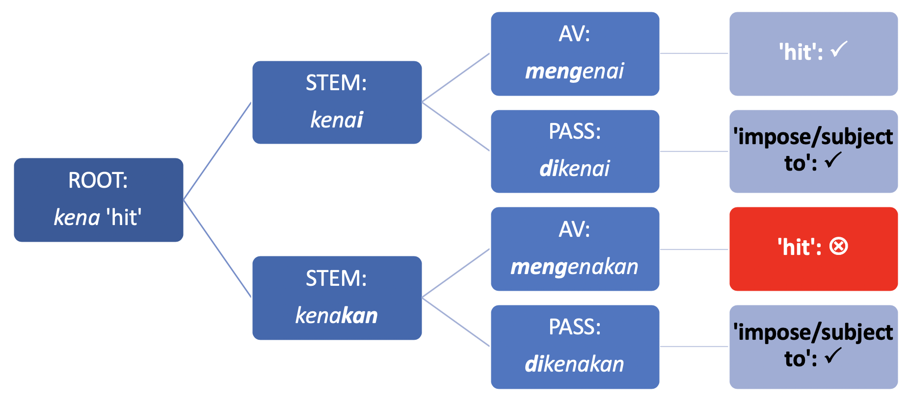

```{r setup, message = FALSE, echo = FALSE}
# global option chunck
knitr::opts_chunk$set(fig.width = 7, 
                      fig.asp = 0.618,
                      fig.retina = 2,
                      dpi = 300,
                      dev = "pdf",
                      echo = FALSE,
                      message = FALSE,
                      warning = FALSE,
                      fig.path = "figures/")
```

```{r load-package, message = FALSE, warning = FALSE}
library(tidyverse)
library(vcd)
```


```{r dikenai-conc-usage}
dikenai_conc <- readr::read_tsv('dataLFG20/dikenai_concordance.txt')
dikenai_conc_tokens <- dim(dikenai_conc)[1]
dikenai_sense <- dikenai_conc %>% 
  mutate(usage = replace(usage, usage == "physical_touch",
                         "come into touch/contact; hit"),
         usage = replace(usage, usage == "physical_disease_affected",
                         "affect (medical; mental)")) %>% 
  count(usage, sort = TRUE) %>% 
  mutate(prop = (n/sum(n))*100,
         verb = "dikenai")
```


```{r mengenai-conc-usage}
mengenai_conc <- readr::read_tsv('dataLFG20/mengenai_concordance.txt')
mengenai_category_count <- mengenai_conc %>% 
  mutate(category = dplyr::if_else(category %in% c("typo", 
                                                   "unclear", 
                                                   "duplicate"),
                                   "excluded",
                                   category)) %>% 
  count(category, sort = TRUE) %>% 
  mutate(prop = round(n/sum(n) * 100, digits = 2))
mengenai_conc_lexicalverb <- mengenai_conc %>% 
  filter(category == "lexical_verb")
mengenai_usage <- mengenai_conc_lexicalverb %>% 
  mutate(usage_gen = senses,
         usage_gen = replace(usage_gen, 
                             usage_gen == "on target",
                             "come into touch/contact; hit"),
         usage_gen = replace(usage_gen,
                             usage_gen == "affect",
                             "affect (medical; mental)")) %>% 
  count(usage_gen, sort = TRUE) %>% 
  mutate(perc = round(n/sum(n) * 100, 2),
         verb = "mengenai")
names(mengenai_usage$n) <- mengenai_usage$usage_gen
mengenai_chisq <- chisq.test(mengenai_usage$n)
```


```{r mengenakan-conc-usage, message=FALSE}
mengenakan_conc <- readr::read_tsv("dataLFG20/mengenakan_concordance.txt")
mengenakan_conc <- mengenakan_conc %>% 
  filter(!usage %in% c("unclear", "duplicate", "typo_mengenakkan")) 
mengenakan_conc <- mengenakan_conc %>% 
  mutate(usage = if_else(str_detect(node_sentences, "duri tajam di kepala-Nya"), "wear", usage)) %>% 
  mutate(usage2 = usage,
         usage2 = if_else(str_detect(usage, "^(wear-pp|apply OBJ)"), "wear", usage2))
mengenakan_conc <- mengenakan_conc %>% 
  mutate(usage2 = if_else(str_detect(usage, "^(deceive|hit|wear-me)"), "others", usage2)) # 'others' is for proportion for each is below 1%
mengenakan_usage <- mengenakan_conc %>% 
  count(usage2, sort = TRUE) %>% 
    rename(usage = usage2) %>% 
  mutate(perc = round(n/sum(n) * 100, 2),
         verb = "mengenakan")
```


```{r dikenakan-conc-usage, message = FALSE}
dikenakan_conc <- readr::read_tsv("dataLFG20/dikenakan_concordance.txt")
dikenakan_conc_tokens <- dim(dikenakan_conc)[1]
dikenakan_conc <- tibble::as_tibble(dikenakan_conc)
dikenakan_conc <- dplyr::filter(dikenakan_conc, !usage %in% c("duplicate", "unclear"))
dikenakan_conc <- dikenakan_conc %>% 
  mutate(usage2 = usage) %>% 
  mutate(usage2 = if_else(str_detect(usage, "^(wear-|be applied to)"), "others", usage2))
dikenakan_usage <- dikenakan_conc %>% 
  count(usage2, sort = TRUE) %>% 
  rename(usage = usage2) %>%
  mutate(prop = (n/sum(n))*100,
         verb = "dikenakan")
names(dikenakan_usage$n) <- dikenakan_usage$usage
dikenakan_chisq <- dikenakan_conc %>% 
  infer::chisq_test(response = usage2)
dikenakan_stdres <- chisq.test(dikenakan_usage$n)$stdres
dikenakan_chisq2 <- chisq.test(dikenakan_usage$n)
```


# Introduction {#intro}

This paper describes a novel approach to the study of grammatical voice (hereafter, voice) in Indonesian by providing fresh, corpus-based evidence that voice alternations for a given verb, especially between active and passive, are not always a meaning-preserving phenomenon [@kroeger_analyzing_2005, 271] (cf. §[\@ref(goals)](#goals)). The idea of "meaning-preserving" in active-passive alternation is that active and passive clauses, based on the same verb, should "describe the same kind of event" [@kroeger_analyzing_2005, 271] or "conveying propositions with the same truth values" [@zuniga_grammatical_2019, 1]. Consider these Indonesian examples.


(@kenakan_av_wear) example for *mengenakan* 'to wear'
(@kenakan_pass_wear) example for *dikenakan* 'to wear'


The base verb is *kena-kan* (derived from the verbal root *kena* 'hit; get into contact with') and it conveys the event of 'wearing a clothing' both in its active form with *meN-* prefix (@kenakan_av_wear) (hereafter AV) and in passive with *di-* prefix (@kenakan_pass_wear) (hereafter PASS). Looking at only these two sentences, the meaning-preserving status is indeed hold for voice alternation (of *kenakan* in AV and PASS). Based on quantitative corpus analysis on the usage of verbs derived from *kena* (see §[\@ref(aims)](#aims))), we argue for the following two empirical evidence (§[\@ref(corpus-results)](#corpus-results)):

- Certain sense of a given verb is significantly more frequently expressed in one voice type than in the other. This suggests that certain sense may be strongly and conventionally associated with certain form of voice ([Figure \@ref(fig:mengenai-dikenai-plot)](#mengenai-dikenai-plot) and [Figure \@ref(fig:mengenakan-dikenakan-plot)](#mengenakan-dikenakan-plot)).
- Certain sense of a given verb can be directly constructed in one voice, in this case PASS, with no corresponding form in the other voice, in this case AV (§[\@ref(kenai-av-pass)](#kenai-av-pass)). This indicates that (i) voice alternation should be relativised to certain sense of a verb such that one sense of a verb may not enter voice alternation, and that (ii) PASS form of a verb in a given sense is not always derived from its AV counterpart; hence not showing a meaning-preserving property ([Figure \@ref(fig:mengenai-dikenai-plot)](#mengenai-dikenai-plot)).

These two points contribute to broader, key theoretical questions in language sciences. Some of these include the questions of how meaning relates to form (CITATION TO LAURA JANDA) and how strong such form-meaning relationship is represented in the linguistic knowledge of speakers of a language (CITATION TO DIESSEL's Grammar Network, or Joan Bybee's). The latter point may also lead to yet other central issues, for instance, in the acquisition, processing, and storage of morphologically complex words (and their meanings) (CITATION).


## Related works and problem statement {#issue}

Corpus-based, quantitative research on voice in Indonesian languages particularly focus on discourse-pragmatic factors (e.g. topicality of patient, transitivity of the event, grounding) that influence voice selection in discourse [for Indonesian, see @wouk_voice_1996; @wouk_impact_1989; for Balinese, @pastika_voice_1999; see also @mcdonnell_symmetrical_2016 who considers additional factors unexplored in previous works, using informal, face-to-face interaction data in Besemah]^[Besemah is "a little-known Malayic language spoken in the remote highlands of South Sumatra in western Indonesia" [@mcdonnell_symmetrical_2016, 11].]. Despite the extensive research on voice in Indonesian context, very little attention has been paid to the role of verb senses and their interaction with voice type of the verb. The question is whether voice alternation for a given verb stem interacts with the semantic potentials of the verb, given a verb can be polysemous. 

McDonnell's [-@mcdonnell_symmetrical_2016, 242-244] *Collostructional Analysis* [@hoffmann_collostructional_2013] in Besemah has shown that certain verbal roots more frequently occur in agentive voice than in patientive voice (in Besemah's symmetrical voice system) [see @gries_extending_2004 for a similar study for voice alternation in English], and found that such degree of attraction plays a role in voice selection, in addition to the other factors (e.g. discourse transitivity and clausal mood). In line with our goal, McDonnell [-@mcdonnell_symmetrical_2016, 250] notes an unexplored factor in voice selection, namely the possibility of semantic properties of the verbal root to account for strong preference of the verb to occur in AV or PASS construction.

## Object of the study {#aims}

We focus on verbs derived from the verbal root *kena* 'hit; get into contact with', which is lexically Patient-oriented (cf. (@kena_example_1)), meaning that the syntactic subject of *kena* is associated with Patient-like role. *Kena* is also associated with negative affectedness on the subject^[Footnote soal collocation dari *kena*].

(@kena_example_1) Example for *kena*

We studied derivatives of *kena* with two transitive suffixes, namely -*kan* (_kena_**_kan_**) and -*i* (_kena_**_i_**); these suffixes can express applicative/causative reading, depending on the roots [see, e.g., @arka_linguistic_2009, amongst others]. The stems *kenakan* and *kenai* can then take the *meN-* and *di-* prefixes that respectively encode AV and PASS voice types. These verbs show puzzling behaviour, as discussed with key examples in (@kenai_initial) and (@dikenai_initial), in relation to their meanings as expressed in certain voice forms.

(@kenai_initial) example 1 from the abstract
(@dikenai_initial) example 2 from the abstract

The original example in (@kenai_initial) is with the -*i* form *mengenai* as the main predicate in AV, expressing the 'physical hit or touch' sense. We put the AV -*kan* form *mengenakan* to indicate that it cannot alternate with *mengenai* to convey the same 'physical hit or touch' sense expressed by *mengenai*. In contrast, example (@dikenai_initial) intends to show that the -*i* and -*kan* verbs can alternate in the PASS in expressing 'subject to' sense. In other words, the PASS *dikenai* and *dikenakan* can equally express 'subject to' sense. These behaviours are summarised in [Figure \@ref(fig:kena-initial-distribution)](#kena-initial-distribution). 

```{r kena-initial-distribution, fig.cap="Form-meaning pairings for *kena*-derived verbs based on (@kenai_initial) and (@dikenai_initial)."}

```

 

## Aims {#goals}

Our corpus-based study seeks to determine whether different senses/meanings of verbal stems *kenakan* and *kenai* find similar distribution across AV and PASS, such that a given sense of the verbs exhibit strong attraction to a given voice type (§[\@ref(corpus-results)](#corpus-results)). We scale up the amount of data that we analysed because, as we shall see, relying on a pair of examples (as in (@kenakan_av_wear) and (@kenakan_pass_wear)) fail to capture asymmetric distribution of senses for a given verb in different voice types. Such an inquiry touches on the idea of meaning-preserving property of voice alternation for a given verb (see §[\@ref(intro)](#intro)). 

The meaning-preserving hypothesis predicts that any senses expressed by a verbal stem in a given voice type (e.g. AV) are also available, or can be expressed in, PASS (as in (@kenakan_av_wear) and (@kenakan_pass_wear)). Even if we do find corpus attestation that each sense occur in AV and PASS, the hypothesis would not predict whether certain sense is equally likely to be expressed in AV and PASS in language use [cf. @mcdonnell_symmetrical_2016, 243]. In other word, meaning-preserving hypothesis does not specify the conventionality of certain sense to occur in certain voice type. **ONE LINER OF THE IMPORTANCE OF USAGE FREQUENCY INFORMATION ABOUT VOICE**.

LFG analysis (§[\@ref(lfg-analysis)](#lfg-analysis)) will capture how semantic properties of the root *kena* join-forces with the semantics of voice morphology and valency-changing suffixes in the construction of meaning found in the derived verbs with *kena*. 

# Data source

```{r leipzig-size, message = FALSE, warning = FALSE}
corpsize <- readr::read_tsv("dataLFG20/leipzig_corpus_size.txt")
corpsize <- corpsize$Size[corpsize$Corpus == "ind_mixed_2012_1M-sentences.txt"]
corpsize <- prettyNum(corpsize, big.mark = ",")
mengenai_concs <- readr::read_tsv('dataLFG20/mengenai_concordance.txt')
mengenai_tokens <- mengenai_concs %>% 
    filter(category == "lexical_verb") %>% nrow()
mengenakan_tokens <- nrow(readr::read_tsv("dataLFG20/mengenakan_concordance.txt"))

```


We retrieved all usage occurrences of our target verbs (*mengenai* [N = `r mengenai_tokens` tokens], *dikenai* [N = `r dikenai_conc_tokens`], *mengenakan* [N = `r prettyNum(mengenakan_tokens, big.mark = ",")`], and *dikenakan* [N = `r dikenakan_conc_tokens`]) from one corpus file, namely `ind_mixed_2012_1M-sentences.txt` (`r corpsize` million word-tokens), a part of the *Indonesian Leipzig Corpora* collection [@quasthoff_indonesian_2013; @goldhahn_building_2012]. This file is derived mostly from Indonesian online news [@quasthoff_indonesian_2013, 26]. For the string *mengenai* in particular, it occurs in total `r prettyNum(nrow(mengenai_concs), big.mark = ",")` tokens, `r max(mengenai_category_count$prop)`% of which is its grammaticalised usage as a preposition meaning 'concerning/regarding to' (@kenai_grammaticalised). The lexical usage of *mengenai* (as in (@kenai_initial)) was manually identified.

(@kenai_grammaticalised) example for grammaticalised *mengenai*

We then categorised the senses of each verb based on two heuristic guidelines: The description of the verb in the Big Dictionary of Indonesian language, and more importantly the semantic types of arguments co-occur with the verb. For instance, the 'subject to/impose' sense of *dikenakan* can be inferred from its co-occurrences with obligation-related nominal arguments and context (@dikenakan_sense_category1). Meanwhile, the 'wear (clothing)' sense of *dikenakan* can be inferred from its co-occurrence with clothing/accessories-related arguments and context (@dikenakan_sense_category2).

(@dikenakan_sense_category1) 'subject to' dikenakan
(@dikenakan_sense_category2) 'wear' sense

Moreover, the primary, physical 'hit' or 'come into touch' sense of *kenai* can be inferred when direct causation is performed from the agent to the patient arguments, which predominantly involve parts of the body; (@kenai_initial) in §[\@ref(aims)](#aims) and (@kenai_primary_sense) below are the typical context. Meanwhile, *kenai* can also encode invisible affectedness sense in the medical and mental domain where certain organ or parts of the body is affected by disease (@kenai_medical_sense), or someone is mentally affected (@kenai_psych_sense).

(@kenai_primary_sense) *kenai* physical hitting 
(@kenai_medical_sense) *kenai* disease
(@kenai_psych_sense) *kenai* psych


# Corpus-based results {#corpus-results}

## Senses for *kenai* in PASS and AV {#kenai-av-pass}

```{r mengenai-dikenai-combined, message = FALSE, warning = FALSE}
mengenai_dikenai <- mengenai_usage %>% 
  rename(usage = usage_gen) %>% 
  bind_rows(dikenai_sense %>% 
              rename(perc = prop))
kenai_senses <- mengenai_dikenai %>% 
  group_by(usage) %>% 
  summarise(n = sum(n)) %>% 
  mutate(perc = round(n/sum(n) * 100, 2)) %>% 
  arrange(desc(n))
```

```{r mengenai-dikenai-chisq-independence}
kenai_xtab <- pivot_wider(select(mengenai_dikenai, usage, n, verb), names_from = verb, values_from = n, values_fill = 0L)
kenai_xtab <- as.matrix(data.frame(kenai_xtab, row.names = 1, stringsAsFactors = FALSE))
kenai_chisq <- chisq.test(kenai_xtab)
kenai_cramer <- round(sqrt(kenai_chisq$statistic / sum(kenai_xtab) * (min(dim(kenai_xtab)) - 1)), 3)
kenai_pval <- format(kenai_chisq$p.value, scientific = TRUE, digits = 3)
rownames(kenai_xtab) <- c("contact/touch/hit", "affect", "subject to")
```

The most frequent senses for *kenai* is 'hit; contact; touch' (N = `r prettyNum(pull(filter(kenai_senses, usage=='come into touch/contact; hit'), n), big.mark = ",")`; `r pull(filter(kenai_senses, usage=='come into touch/contact; hit'), perc)`%), followed by 'subject to/imposed' (N = `r prettyNum(pull(filter(kenai_senses, usage=='subject to/imposed'), n), big.mark = ",")`; `r pull(filter(kenai_senses, usage=='subject to/imposed'), perc)`%) and disease/mental 'affect' (N = `r prettyNum(pull(filter(kenai_senses, usage=='affect (medical; mental)'), n), big.mark = ",")`; `r pull(filter(kenai_senses, usage=='affect (medical; mental)'), perc)`%). [Figure \@ref(fig:mengenai-dikenai-plot)](#mengenai-dikenai-plot) visualises the distribution of these senses in PASS and AV forms of *kenai*. The height of the bars represent percentages, with the raw numbers are given inside the bars.

```{r mengenai-dikenai-plot, fig.cap="Distribution of senses for *kenai* in PASS and AV"}
mengenai_dikenai_plot <- mengenai_dikenai %>% 
  mutate(usage = fct_reorder(usage, -n)) %>% 
  ggplot(aes(x = verb, y = perc, fill = usage)) + 
  geom_col(position = position_dodge()) + 
  geom_text(aes(label = paste(round(perc, 2), "%", sep = "")), 
            position = position_dodge(0.9), 
            vjust = -0.5) + 
  geom_text(aes(label = paste("n=", n, sep = "")), 
            position = position_dodge(0.9), 
            vjust = 1.25) +
  scale_fill_manual(values=c("#A6CEE3", "#FDBF6F", "#009E73")) +
  labs(fill = "senses") +
  ylab("percentage") +
  xlab("verbs") +
  scale_x_discrete(breaks = c("dikenai", "mengenai"),
                   labels = c("dikenai (PASS)", "mengenai (AV)")) +
  theme_light()
p <- mengenai_dikenai_plot +
  labs(title = "Distribution of senses for *kenai* in PASS and AV")
ggsave("figsLFG20/rajeg-rajeg-arka_2020_fig2-senses-of-kenai-in-PASS-AV.png", plot = p, units = "in", height = 6, width = 8)
mengenai_dikenai_plot
```


It is clear that the distribution of senses for *kenai* is not equal across voice. The primary, physical sense of *kenai* 'hit; come into touch/contact' can indeed occur in PASS and AV, but its proportion is much greater to be expressed in AV (`r round(pull(filter(mengenai_usage, usage_gen == "come into touch/contact; hit"), perc), 2)` %) than in PASS (`r round(pull(filter(dikenai_sense, usage == "come into touch/contact; hit"), prop), 2)`%). Slight distributional difference could as well be seen in the least frequent sense of 'medical/mental affect'.

[Figure \@ref(fig:mengenai-dikenai-plot)](#mengenai-dikenai-plot) also reveals an empirical evidence that voice alternation is not always a meaning-preserving phenomenon. It is shown by the absence of 'subject to/be imposed' sense in AV; this sense is only found in PASS and intriguingly is the most frequent of all senses of *kenai* in PASS. This indicates that 'subject to/be imposed' is directly constructed and conventionalised in PASS. Hence, it should not be regarded as a derivative of an (underlying) AV form, which is empirically not attested for this sense in the corpus.

A chi-square test for independence suggests that the asymmetric distribution of senses for *kenai* in PASS and AV (i) cannot be due to chance (i.e. it is statistically significant) (*X*^2^ = `r unname(round(kenai_chisq$statistic, 3))`, *df* = `r unname(kenai_chisq$parameter)`, *p*~two-tailed~ `r if (kenai_chisq$p.value < 0.001) {"< 0.001"}`) and (ii) demonstrates a highly strong effect size (Cramer's *V* = `r kenai_cramer`)^[Cramer's *V* is a measure of effect size that is independent of sample size, unlike the significance level, which is dependent on the sample size (Levshina 2015: 209). Cramer's *V* ranges from 0 (no association) to 1 (strong and perfect association). Strong effect size is shown by Cramer's *V* value equal to or greater than 5 (Levshina 2015:209).]. The effect is indicated by the significantly strong preference of 'hit; come into touch/contact' sense to be expressed in AV (i.e. it has positive residuals for AV) and of 'subject to/be imposed' sense in PASS without AV occurrence^[Space prevents us to include the Association plot [\@ref(fig:kenai-assocplot)](#kenai-assocplot) in the manuscript, showing this strong preference effect for *kenai* as well as for *kenakan* (see §[\@ref(kenakan-av-pass)](#kenakan-av-pass)), but we published the plot as part of open-access supplementary materials.].

```{r kenai-assocplot-saving, fig.asp=0.8, include = FALSE}
rownames(kenai_xtab)[1] <- "contact; hit"
colnames(kenai_xtab) <- c("AV-mengenai", "PASS-dikenai")
png("figsLFG20/rajeg-rajeg-arka_2020_fig0-1-association-plot-kenai.png", units = "in", width = 9, height = 8, res = 300)
vcd::assoc(kenai_xtab, main = expression(paste("Association plot between senses of ", italic(kenai), " and voice", sep = "")), shade = TRUE, sub = "Bluish shading indicates positive residuals while redish shows negative residuals.\nSignificant positive association (bluish): strong preference of 'hit' for AV and 'subject to' for PASS.", sub_gp = gpar(fontsize = 10), main_gp = gpar(fontsize = 15), labeling_args = list(set_varnames = c(A = "Senses", B = "Voice")))
dev.off()
```


```{r kenai-assoc-plot, fig.asp=0.8}
vcd::assoc(kenai_xtab, main = expression(paste("Association plot between senses of ", italic(kenai), " and voice", sep = "")), shade = TRUE, sub = "Bluish shading indicates positive residuals while redish shows negative residuals.\nSignificant positive association (bluish): strong preference of 'hit' for AV and 'subject to' for PASS.", sub_gp = gpar(fontsize = 10), main_gp = gpar(fontsize = 15), labeling_args = list(set_varnames = c(A = "Senses", B = "Voice")))
```


## Senses for *kenakan* in PASS and AV {#kenakan-av-pass}

```{r mengenakan-dikenakan-combined, message=FALSE, warning=FALSE}
mengenakan_dikenakan <- mengenakan_usage %>% 
  mutate(usage = replace(usage, usage == "impose", "subject to/imposed")) %>% 
  bind_rows(dikenakan_usage %>% 
              rename(perc = prop))
kenakan_senses <- mengenakan_dikenakan %>% 
  group_by(usage) %>% 
  summarise(n = sum(n)) %>% 
  mutate(perc = round(n/sum(n) * 100, 2)) %>% 
  arrange(desc(n))
```


The lion share of the usage occurrences of *kenakan* convey the 'wear; put on' sense (N = `r prettyNum(pull(filter(kenakan_senses, usage=='wear'),n), big.mark = ",")`; `r pull(filter(kenakan_senses, usage=='wear'), perc)`%), followed by 'subject to/imposed' (N = `r prettyNum(pull(filter(kenakan_senses, usage=='subject to/imposed'),n), big.mark = ",")`; `r pull(filter(kenakan_senses, usage=='subject to/imposed'), perc)`%) and other senses (N = `r prettyNum(pull(filter(kenakan_senses, usage=='others'),n), big.mark = ",")`; `r pull(filter(kenakan_senses, usage=='others'), perc)`%). [Figure \@ref(fig:mengenakan-dikenakan-plot)](#mengenakan-dikenakan-plot) visualises the distribution of these senses in PASS and AV forms of *kenakan*.

```{r mengenakan-dikenakan-plot, fig.cap="Distribution of senses for *kenakan* in PASS and AV"}
mengenakan_dikenakan_plot <- mengenakan_dikenakan %>% 
  mutate(usage = fct_reorder(usage, -n)) %>% 
  ggplot(aes(x = verb, y = perc, fill = usage)) + 
  geom_col(position = position_dodge()) + 
  geom_text(aes(label = paste(round(perc, 2), "%", sep = "")), 
            position = position_dodge(0.9), 
            vjust = -0.5) + 
  geom_text(aes(label = paste("n=", n, sep = "")), 
            position = position_dodge(0.9), 
            vjust = 1.25) +
  scale_fill_manual(values=c("#1F78B4", "#FDBF6F",
                             "#999999")) +
  labs(fill = "senses") +
  ylab("percentage") +
  xlab("verbs") +
  scale_x_discrete(breaks = c("dikenakan", "mengenakan"),
                   labels = c("dikenakan (PASS)", "mengenakan (AV)")) +
  theme_light()
p <- mengenakan_dikenakan_plot +
  labs(title = "Distribution of senses for *kenakan* in PASS and AV")
ggsave("figsLFG20/rajeg-rajeg-arka_2020_fig3-senses-of-kenakan-in-PASS-AV.png", plot = p, units = "in", height = 6, width = 8)
mengenakan_dikenakan_plot
```

```{r mengenakan-dikenakan-chisq-independence, message = FALSE, warning = FALSE}
kenakan_xtab <- pivot_wider(select(mengenakan_dikenakan, usage, n, verb), names_from = verb, values_from = n, values_fill = 0L)
kenakan_xtab <- as.matrix(data.frame(kenakan_xtab, row.names = 1, stringsAsFactors = FALSE))
kenakan_chisq <- chisq.test(kenakan_xtab)
kenakan_cramer <- round(sqrt(kenakan_chisq$statistic / sum(kenakan_xtab) * (min(dim(kenakan_xtab)) - 1)), 3)
kenakan_pval <- format(kenakan_chisq$p.value, scientific = TRUE, digits = 3)
```

Similar trend of distributional asymmetry can be seen from [Figure \@ref(fig:mengenakan-dikenakan-plot)](#mengenakan-dikenakan-plot), as observed previously in [Figure \@ref(fig:mengenai-dikenai-plot)](#mengenai-dikenai-plot). The proportion of the two most frequent senses for *kenakan* (i.e. 'wear' and 'subject to/be imposed') differs in AV and PASS. 'Wear; put on', while indeed attested in AV and PASS, is much more frequently expressed in AV (`r round(pull(filter(mengenakan_dikenakan, usage == "wear", verb == "mengenakan"), perc), 2)`%) than in PASS (`r round(pull(filter(mengenakan_dikenakan, usage == "wear", verb == "dikenakan"), perc), 2)`%). In contrast, 'subject to/be imposed' is expressed much more frequently in PASS (`r round(pull(filter(mengenakan_dikenakan, usage == "subject to/imposed", verb == "dikenakan"), perc), 2)`%) than in AV (`r round(pull(filter(mengenakan_dikenakan, usage == "subject to/imposed", verb == "mengenakan"), perc), 2)`%). 

The chi-square test for independence suggests that this asymmetric distribution is statistically significant (*X*^2^ = `r unname(round(kenakan_chisq$statistic, 3))`, *df* = `r unname(kenakan_chisq$parameter)`, *p*~two-tailed~ `r if (kenakan_chisq$p.value < 0.001) {"< 0.001"}`) and has a strong effect size (Cramer's *V* = `r unname(kenakan_cramer)`). The effect is shown by the significantly strong preference of 'wear' to be encoded in AV (but dispreferred in PASS) and of 'subject to/imposed' in PASS (but dispreferred in AV).

Considering the PASS of the two stems *kenai* (§[\@ref(kenai-av-pass)](#kenai-av-pass)) and *kenakan*, they exhibit similar semantic traits, namely most predominantly used in expressing the 'subject to/be imposed' sense. This sense is so frequent for the PASS of *kenai* and *kenakan* that it is unsurprisingly interchangeably expressed by these two PASS forms, as pointed out in §[\@ref(aims)](#aims) in example (@dikenai_initial). Furthermore, the 'others' category for the AV *mengenakan* include `r nrow(filter(mengenakan_conc, str_detect(usage, "^hit")))` tokens of physical 'hit/touch' sense (@kenakan_touch), which we canceled out for this verb in (@kenai_initial) based on our intuitive, native-speaker judgment. 

(@kenakan_touch) pukulan itu <m>mengenakan</m> tepat di pundaknya (900892)

Corpus analysis reveals both (i) the attestation of this 'hit/touch' sense with *mengenakan* and (i) its statistical dispreference for *mengenakan* compared to its strong association with *mengenai* (see [Figure \@ref(fig:mengenai-dikenai-plot)](#mengenai-dikenai-plot)).

Viewed from the perspective of usage-based, cognitive linguistics, which considers the important role of frequency in the emergence, representation, and processing of linguistic units, our findings call into question the implicitly presumed equal status of PASS and AV alternation for a given verb stem, in terms of their conventionality and usage frequency in conveying certain sense. Previous usage-based study on constructional alternation (e.g. Locative alternation of SPRAY/LOAD verbs) in Russian also suggest asymmetric distribution of certain construction type in relation to aspectual prefixes attached to the verb (Sokolova 2012).


```{r kenakan-assocplot-saving, fig.asp=0.8, include=FALSE}
colnames(kenakan_xtab) <- c("AV-mengenakan", "PASS-dikenakan")
png("figsLFG20/rajeg-rajeg-arka_2020_fig0-2-association-plot-kenakan.png", units = "in", width = 9, height = 8, res = 300)
vcd::assoc(kenakan_xtab, main = expression(paste("Association plot between senses of ", italic(kenakan), " and voice", sep = "")), shade = TRUE, sub = "Bluish shading indicates positive residuals while redish shows negative residuals.\nSignificant positive association (bluish): strong preference of 'wearing' for AV and 'subject to' for PASS.", sub_gp = gpar(fontsize = 10), main_gp = gpar(fontsize = 15), legend_args = list(width = unit(0.4, "lines")), labeling_args = list(set_varnames = c(A = "Senses", B = "Voice")))
dev.off()
```

```{r kenakan-assocplot, fig.asp=0.8}
vcd::assoc(kenakan_xtab, main = expression(paste("Association plot between senses of ", italic(kenakan), " and voice", sep = "")), shade = TRUE, sub = "Bluish shading indicates positive residuals while redish shows negative residuals.\nSignificant positive association (bluish): strong preference of 'wearing' for AV and 'subject to' for PASS.", sub_gp = gpar(fontsize = 10), main_gp = gpar(fontsize = 15), legend_args = list(width = unit(0.4, "lines")), labeling_args = list(set_varnames = c(A = "Senses", B = "Voice")))
```


# LFG Analysis {#lfg-analysis}

# Conclusion
  
# References {-}
  